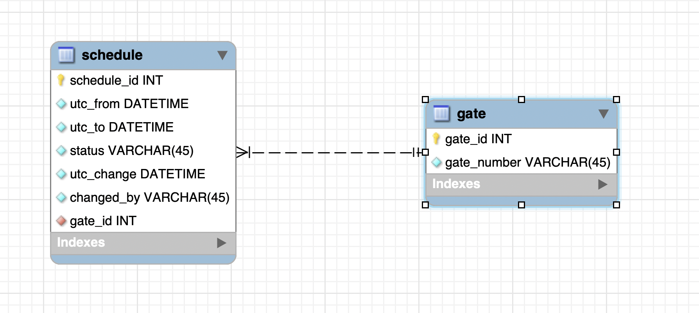

# Project 


In short, the idea is to have airport gates on one side, and flights/planes on other side so planes will be assigned to gates. Also, there is administrator that can manually handle the "status" of the gate.

Gate can have "free", "busy" or "plane" status. First two are configured by administrator, and "plane" is assigned once the actual flight/plane asks for gate.

Administrator can set some gate as "busy" and it will not be able to accept planes/flights. Additionally, administrator is able to make actual gate as "free" which means that parked plane left the gate. 


### Data Model



Data model contains two tables:

- **Gate** - just a placeholder for gate_number, it is extracted as separate table because it can contain additional information. Initial state of database contain 8 gates (A1-A4) and (B1-B4)
- **Schedule** - stores all events/history of actions that are occurred on specific **gate**. Initial state contains 8 "events" (single event for each gate) that say that gates are "free". Example of a single row/event for gate A1 is as follows:
  - **utc_from:  1970-01-17 00:00:01** - date in the past
  - **utc_to:  2038-01-19 03:14:07** - date in the future (very far in the future)
  - **status:  free** - gate is "free" in time period between utc_from and utc_to. It can be also "busy" and "plane". But, instead of writing just "plane", it contains information about flight  
  - **utc_change:  2021-01-17 13:00:00** - timestamp of the change, every other change will be after this one so it will be applied with higher priority 
  - **changed_by:  system** - later, it wll contain information about users changed the status of the gate


Table **Schedule** is central point for all information. Since, everything is event based, it would be possible to:

- See when and by whom the gate status is changed
- Create SQL Views that actually shows real schedule of the gates (now and in the past) and also generate reports about gates occupancy
- Easiliy plan multiple "busy" status for single gate. It can be configured that gate is "busy" (closed) every weekend but also on special occasions.

*Without specific reason, mysql database is used for this implementation*

---

---

### Startup

Project is packed as docker image, and can be started using docker-compose together with database. 

```bash
git clone https://github.com/stuparmihailo/project.git
cd project
docker-compose up
```

It will start two containers:

- db - mysql database with initial state (8 gates and 8 free schedules)
- project - spring boot application that is connected to db. 

*Note that project will crash for the first time becausee the database is not yet ready. Therefore there is flag `restart: on-failure` to restart this container. Second start will connect succesfully. This dirty hack should not be used in real scenarios, but probably docker-compose will not be used in reality either...*


###### docker-compose file (part):

```yml
...       
    image: stupar/project
    ports: 
      - "8080:8080"
      - "8443:8443"
    expose:
      - "8080"         # both ports are exposed, because if someone hits http (8080)  
      - "8443"         # project will redirect to https (8443)
    environment:
      ...
      - SPRING_PROFILES_ACTIVE=https   # to disable https, enable http spring profile
      - SERVER_HTTP_PORT=8080
      - SERVER_HTTPS_PORT=8443
      - SERVER_SECURITY_USERS_FILE=/users.txt
...
```

#### 

### HTTPS 

HTTPS is enabled in provided configuration (`SPRING_PROFILES_ACTIVE=https`). Certificate that is used in this case is self-signed certificate generated for this project. This certificate (.jks) is packed inside .jar and can be replaced using following environemnt variables:

```properties
SERVER_SSL_KEY_STORE_TYPE=      # PKCS12|JKS
SERVER_SSL_KEY_STORE=           # path to file (.p12 or .jks)
SERVER_SSL_KEY_STORE_PASSWORD=  
SERVER_SSL_KEY_ALIAS=           
```

Once the https is configured (already provided configuration) and docker container is started, by visiting some of urls:

http://localhost:8080/openapi.html 

https://localhost:8443/openapi.html

Browser will not accept this self-signed certificate. Chrome doesn't and it shows "Your connection is not private". Following links should help in this case: 

https://stackoverflow.com/questions/58802767/no-proceed-anyway-option-on-neterr-cert-invalid-in-chrome-on-macos

https://twitter.com/zairwolf/status/1196878125734486021


### HTTP

In order to start project with HTTP protocol only, change the environment variable in docker-compose.yaml file:

```properties
SPRING_PROFILES_ACTIVE=http
```

In that case, https property `SERVER_HTTPS_PORT` will be ignored and app will be accessible only through http port:

http://localhost:8080/openapi.html 


### OpenAPI

Once opened http://localhost:8080/openapi.html, swagger documentation will be shown. Url can be changed using the property:

```properties
SPRINGDOC_SWAGGER_UI_PATH=     // currently it is: /openapi.html
```

 There, all apis are listed together with "Authorize" button. Authorization is important before every request or service will return `401 Unauthorized` .


### Authorization

All APIs, except OpenAPI page, are protected:

- **/gates** with role USER
- **/admin/gates** with role ADMIN 

These users are imported from file that is currently part of the docker image. If case that this file should be switched with new one, appropriate volume should be created and poperty change is needed:

```properties
SERVER_SECURITY_USERS_FILE=            # path to file
SERVER_SECURITY_PASSWORD_ENCODER=      # bcrypt is only one supported right now
```

Format of the users is `username:bcrypt-encoded-password:role`

```
bob:$2y$12$GcGbWfDWonM5KRvB.HUqT.5p8ZFu0/RRJYZjMrxrV3MZMuyBCctvS:USER
jane:$2y$12$iLEhGx3Ka3w9BVKen9xJLOYW7ppJIS.Dn2CzOxlf26vXXAIh/GYQe:ADMIN
```

In provided configuration, there are two users, and they should be used for testing the apis.

```
bob:bob:USER
jane:jane:ADMIN
```

---

APIs are protected with Basic Authorization, so executing curl commands should look like:

```bash
# USER
curl -X GET "https://localhost:8443/gates" -H  "Authorization: Basic Ym9iOmJvYg==" -k
                                              # Authorization: Basic <base64 bob:bob>
      
# ADMIN      
curl -X POST "https://localhost:8443/admin/gates/free" -H  "Content-Type: application/json" \ 
              -d "{\"gateNumber\":\"A1\"}" -H  "Authorization: Basic amFuZTpqYW5l" -k      
																						  # Authorization: Basic <base64 jane:jane>
```


### Database

Currently, only supported database is mysql. It is configured through properties:

```properties
SPRING_DATASOURCE_URL=            # jdbc:mysql://db:3306/project
SPRING_DATASOURCE_USERNAME=       #  root
SPRING_DATASOURCE_PASSWORD=       #  root
DATABASE_TYPE=                    #  mysql (important property although not standart spring.datasoruce property)
                                  #  it is used to enable abstraction in the code, where native queries are 
                                  #  needed
```


---

---

### Sample Request Flow (Happy Flow)

1) Check all gates

> // bob:bob:USER

```bash
curl -X GET "https://localhost:8443/gates" -H  "Authorization: Basic Ym9iOmJvYg==" -k
```


2) Set A* gates as "busy" in the weekend during the first week of february

> jane:jane:ADMIN

```bash
for i in {1..4}
do
 echo "Make busy A$i"
 curl -X POST "https://localhost:8443/admin/gates" \
      -H "Authorization: Basic amFuZTpqYW5l" \
      -H  "Content-Type: application/json" \
      -d "{\"from\":\"2021-02-06T00:00:00.000Z\",
           \"to\":\"2021-02-08T00:00:00.000Z\",
           \"status\":\"busy\",
           \"gateNumber\":\"A$i\"}" -k
 echo "\n----"
done
```


3) Assign 9 flights to gates. 9th one will get response that there are no free `"available": "false"` gates:

> bob:bob:USER

```bash
for i in {1..9}
do
 echo "Try to assign flight LH100$i"
 curl -X POST "https://localhost:8443/gates/assign" \
      -H  "Authorization: Basic Ym9iOmJvYg==" \
      -H  "Content-Type: application/json" \
      -d "{\"flightNumber\":\"LH100$i\"}" -k
 echo "\n----"
done
```

4) Make A1-A4 gates free (unpark planes from the gate) 

> jane:jane:ADMIN

```bash
for i in {1..4}
do
 echo "Make gate A$i free"
 curl -X POST "https://localhost:8443/admin/gates/free" \
      -H "Authorization: Basic amFuZTpqYW5l" \
      -H  "Content-Type: application/json" \
      -d "{\"gateNumber\":\"A$i\"}" -k
 echo "\n----"
done
```

5) Try to make A1 free again (it is already free/no plane assigned). It is considered as error

> jane:jane:ADMIN

```bash
 curl -X POST "https://localhost:8443/admin/gates/free" \
      -H "Authorization: Basic amFuZTpqYW5l" \
      -H  "Content-Type: application/json" \
      -d "{\"gateNumber\":\"A1\"}" -k
```

6) Make sure that gate A1 is free

> bob:bob:USER

```bash
curl -X GET "https://localhost:8443/gates/A1/status" -H  "Authorization: Basic Ym9iOmJvYg==" -k
```

